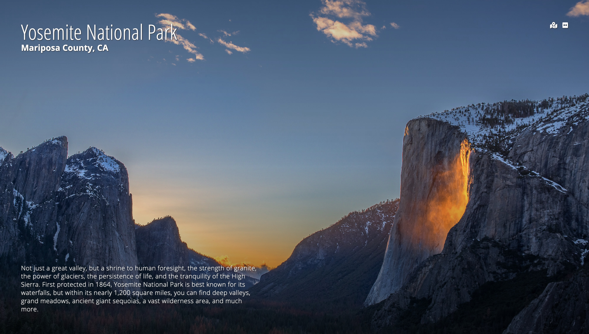

# Outdoor Inspiration

A new tab extension that displays photos and descriptions of US National Parks

| Chrome | Firefox |
| --- | --- |
| [Download](https://chrome.google.com/webstore/detail/mjgkcdcikkpendiikknkdhanooeiohee/) | [Download](https://addons.mozilla.org/en-US/firefox/addon/outdoor-inspiration/) |

> The page can also be previewed [here](https://outdoor-inspiration.netlify.app/) as well as run locally.



Photos from the application are fetched from my galleries in [Flickr](https://www.flickr.com/photos/188326816@N04/galleries), and information about the park is pulled from the [NPS website](https://www.nps.gov/index.htm).

###### Please consider supporting my work and other projects:

[](https://offset.earth/luisaugusto)
[](https://www.buymeacoffee.com/luiscodes)

## Installation

Clone the repository to your computer and install dependencies.

```
$ git clone git@github.com:luisaugusto/outdoor-inspiration.git
$ cd outdoor-inspiration

$ npm install
```

## Usage

Compiles and hot-reloads for development:

```
npm run serve
```

Lints and fixes files:

```
npm run lint
```

## Building the Extensions

You can use `npm run build` to build the Vue app, and after that you will need to zip the files in the `dist` directory. Don't just compress the `dist` directory, select all the files and compress those together. Compressing the `dist` directory directly may add a level of directories, and it might not be read correctly by the browsers.

For Firefox, you can upload a build locally by navigating to [about:debugging](about:debugging), and load a temporary add-on from there. You can find more instructions [here](https://extensionworkshop.com/documentation/develop/temporary-installation-in-firefox/).

For Chrome, you can load an extension by going to [chrome://extensions/](chrome://extensions/) with developer mode enabled. You can find more instructions [here](https://developer.chrome.com/extensions/getstarted).

## Contributing

Pull requests are welcome. For major changes, please open an issue first to discuss what you would like to change.

To make a contribution, you can follow these steps:

1. Fork the repository to your account and clone your forked copy.
2. Create a new branch and make any changes on that branch.
3. Create a pull request using that branch onto my master branch. If the changes are to resolve an issue, please reference the issue number in the pull request.